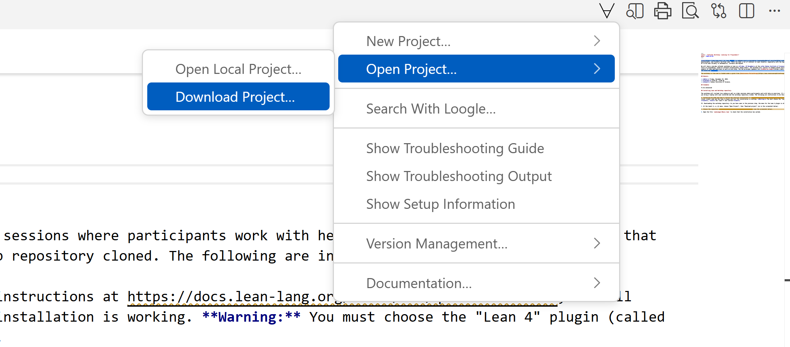
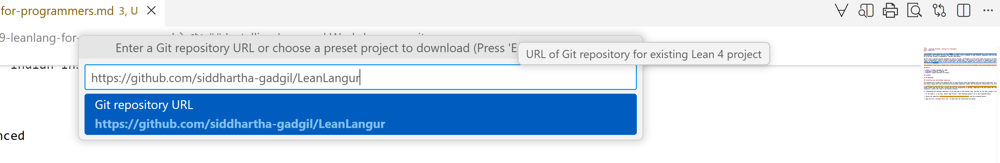

[Lean](https://lean-lang.org/) (or Lean Prover) is an open-source programming language and proof assistant that enables correct, maintainable, and formally verified code. There has been a lot of interest in Lean recently, especially with the hope that it can enable AI to be used reliably in mathematics, software and beyond.

We will have a one-day informal workshop on Lean on **Friday, 19 December** at the **the Indian Institute of Science, Bangalore**, with a focus on programming, aimed at software professionals among others. The workshop will consist of example based introductions to various aspects of Lean and exercises to work on with help. The two principal speakers are [Siddhartha Gadgil](https://math.iisc.ac.in/~gadgil/) and Anand Rao Tadipatri.

The workshop is free and is funded under a grant from [Renaissance Philanthropy](https://www.renaissancephilanthropy.org/). 

## Details

* **Date:** Friday, December 19, 2025.
* **Timings:** 9:30 am - 5:00 pm.
* **Venue:** F12, Old Physics building, Indian Institute of Science. ([Google Maps link](https://maps.app.goo.gl/MujiX8s2969f2ZUc9))
* **Workshop Repository:** [https://github.com/siddhartha-gadgil/LeanLangur](https://github.com/siddhartha-gadgil/LeanLangur)

## Schedule

* 9:30 - 10:30 am : Siddhartha Gadgil, *Introduction to Programming in Lean*
* 10:30 - 10:45 am : Coffee break
* 10:45 - 11:45 am : Anand Rao Tadipatri, *Formal Ways for your Mathematical Plays - I*
* 11:45 am - 2:00 pm : labs and lunch
* 2:00 - 2:45 pm : Siddhartha Gadgil, *Monads and Metaprogramming in Lean*
* 2:45 - 3:30 pm : Anand Rao Tadipatri, *Formal Ways for your Mathematical Plays - II*
* 4:00 pm - 5:00 pm : Discussion and labs (beginning with a short introduction to the `LeanAide` project).'

## Installing Lean and Workshop repository

The workshop will include live coding as well as *lab* sessions where participants work with help on exercises. It is recommended that you bring a laptop with Lean installed and the workshop repository cloned. The following are instructions to do this.

I. Installing VS Code and Lean 4: Follow the [official instructions](https://docs.lean-lang.org/lean4/doc/quickstart.html), install visual studio code and the Lean 4 plugin and test the installation is working. **Warning:** You must choose the "Lean 4" plugin (called **lean4**), **not** the "Lean 3" one (called **lean**).

II. Downloading the workshop repository: As you have seen in the previous step, the menu for the Lean 4 plugin is at the ∀ symbol.

1. At the Lean4 (i..e, ∀) menu, choose "Open Project", then "Download project" (as in the screenshot below).

2. Choose the repository https://github.com/siddhartha-gadgil/LeanLangur (see the screenshot below).

3. Open the file `LeanLangur/Basic.lean` to check that the installation has worked.
